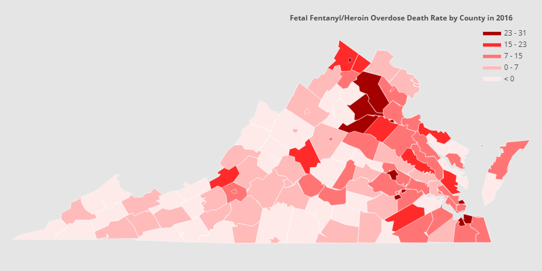

# Opioid Addiction Crisis in Virginia

Virginia  is  currently  under  a  public  health  emergency  as a  result  of  the  opioid  addiction  crisis.  Our  state  has  been severely impacted by opioid abuse, and the situation has been escalating  surprisingly  fast  in  recent  years.  In  1999,  the  first year for which such data is available, approximately 23 people died  from  abuse  of  prescription  opioids. However, by 2017, the  most  recent  year  for  which  complete  data is available, 1445 people died of the overdose of Fentanyl, Heroin or Prescription Opioid, an epidemic increase of roughly 6200%. Moreover,  the  data  of  2015-2017  alone,  showed  us  that there  was  a  staggering  increase  of  more  than  60%  in  death attributed  to drug overdose. Drug-related deaths have  risen unrelentingly,  and  the  drugs  kill  more  people  annually  in Virginia than either car crashes or gunfire. This situation needs to  be  controlled and  we  should  contribute  our  efforts  as community members.Our project is intended to study the drug abuse problem here in Virginia using machine learning methods, and bring awareness to this widespread public health issue by presenting a thorough analysis of the problem, and  possible solutions for different parties to reverse the epidemic of opioid drug overdose deaths and protect the public from overdose and other harms.

This  project  examines  the  opioid  addiction  crisis  in  the state  of  Virginia  through  related  indicators  such  as  Overdose Deaths, ED Visits, Hepatitis C and Diagnosed HIV. By examining the occurrence, we visualized the Virginia Opioid dataset and discovered correlations to opioid addiction in the state of Virginia. These correlations include age group, case count, rate and  year  for  each  related  opioid  addiction  indicator.  In  this project,  we  use  two  major  strategies:  (1)  Analyzing  and  Visualizing the data-set to discover and understand patterns and re-occurrences for the case being studied and (2) Carrying out Machine  Learning  Techniques  in  order  to  find  hidden  structures  and  anomalies  on  data.  This  projects  utilizes  machine learning  techniques  such  as  Isolation  Forest,  K-Means, Mean  Shift  and  Dimensionality  reduction  techniques  such as  Principal  component  analysis(PCA)  to  better  represent and understand the data-set being worked on.
## data link:
[click me](http://www.vdh.virginia.gov/content/uploads/sites/110/2018/11/Opioid-Dashboard-Dataset-View.xlsx)

[click me](http://www.vdh.virginia.gov/content/uploads/sites/110/2018/11/Opioid-Dashboard-Dataset-View-Age-Groups.xlsx)
## preprocessing file:
[handle star](https://www.dropbox.com/s/37kgpktnbo0p75u/Opioid_Age_Groups_handle_star.csv?dl=0)

[datavizz_ver1101](https://www.dropbox.com/s/5e327w7txeuqyno/dataset_properties_1101.ipynb?dl=0)

## report:

[view only^_^]: (https://www.overleaf.com/read/nfxmmbhtjngr)

see it in [report](./report) directory.

## video link:
[click me](https://youtu.be/Cq-OQ9UcBRo)

## Acknowledgments

This work  has  been  a  part  of  the  Machine  Learning  forVirginia project at the University of Virginia in Fall 2018.We would also like to thank the Virginia Department of Healthfor providing the Virginia Opioid Dashboard Dataset.
